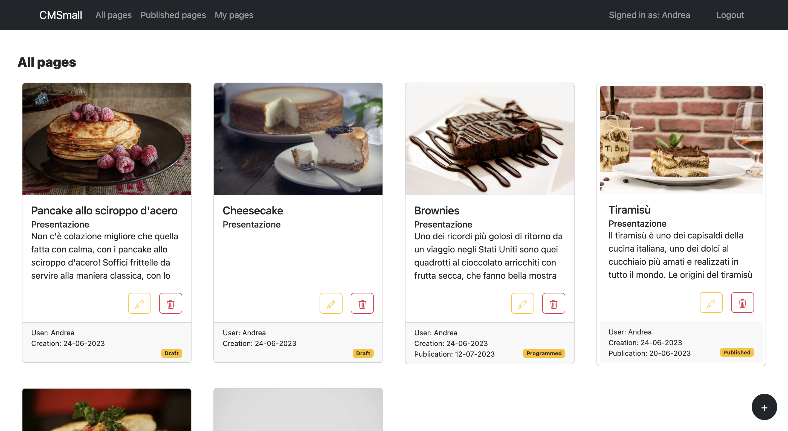
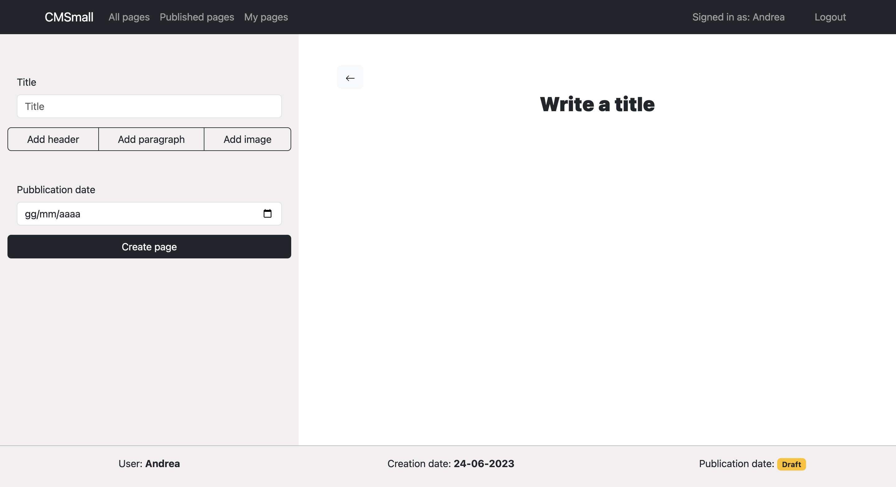

# Exam #1: "CMSmall"
## Student: s318927 SCAMPORRINO ANDREA

## Screenshot

- All pages (Home)


- Form for creating a page


## React Client Application Routes

- Route `/`: Main screen, displays all pages with the ability to filter them when the user is logged in, and only published ones when not logged in.
- Route `/page/:id`: Displays the content of the page.
- Route `/add`: Form for creating a new page.
- Route `/edit/:id`: Form for editing a selected page using its ID.
- Route `/login`: Shows the screen for user login.
- Route `/*`: Route for non-existing pages.

## API Server

### Authentication

#### Create a new session (login)

URL: `/api/sessions`

HTTP Method: POST

Description: Creates a new session based on the provided credentials.

Request body:
```
{
  "username": "user@polito.it",
  "password": "pwd"
}
```

Response: `200 OK` (success), `401 Unauthorized` (error).

Response body:
```
{
  "id":1,
  "username":"user@polito.it",
  "name":"user",
  "admin":0
}
```

#### Return the current session if present

URL: `/api/sessions/current`

HTTP Method: GET

Description: Checks if the session is valid and returns user information. A valid session ID cookie must be provided to get authenticated user information.

Request body: _None_

Response: `201 Created` (success), `401 Unauthorized` (error).

Response body:
```
{
  "id":1,
  "username":"user@polito.it",
  "name":"user",
  "admin":0
}
```

#### Delete the current session (logout)

URL: `/api/sessions/current`

HTTP Method: DELETE

Description: Deletes the current session. A valid session ID cookie must be provided.

Request body: _None_

Response: `200 OK` (success), `500 Internal Server Error` (generic error).

Response body: _None_

### General

#### Return the site title

URL: `/api/title`

HTTP Method: GET

Description: Returns the title of the site.

Request body: _None_

Response: `200 OK` (success), `500 Internal Server Error` (Database error).

Response body:
```
"CMSmall"
```

#### Return all pages

URL: `/api/pages`

HTTP Method: GET

Description: Returns all pages for display on the user's home screen after login. Each page consists of its properties and an array of blocks containing only the first header, the first paragraph, and the first image (if any). A valid session ID cookie must be provided.

Request body: _None_

Response: `200 OK` (success), `500 Internal Server Error` (Database error). If the request is not from an authenticated session, `401 Unauthorized`.

Response body:
```
[
  {
    "id": 67,
    "title": "La mia prima pagina",
    "idUser": 1,
    "name": "user",
    "creationDate": "2023-06-09T22:00:00.000Z",
    "publicationDate": "2023-06-20T22:00:00.000Z",
    "blocks": [
      {
        "type": "Header",
        "content": "Questo è un header",
        "position": 0
      },
      {
        "type": "Image",
        "content": "http://localhost:3001/image1.jpg",
        "position": 2
      },
      {
        "type": "Paragraph",
        "content": "Questo è un paragrafo",
        "position": 1
      }
    ]
  },
  ...
]
```

#### Return all published pages

URL: `/api/pages/published`

HTTP Method: GET

Description: Returns all pages already published for display on the user's home screen without login. Each page consists of its properties and an array of blocks containing only the first header, the first paragraph, and the first image (if any).

Request body: _None_

Response: `200 OK` (success), `500 Internal Server Error` (Database error).

Response body:
```
[
  {
    "id": 67,
    "title": "La mia prima pagina",
    "idUser": 1,
    "name": "user",
    "creationDate": "2023-06-09T22:00:00.000Z",
    "publicationDate": "2023-06-20T22:00:00.000Z",
    "blocks": [
      {
        "type": "Header",
        "content": "Questo è un header",
        "position": 0
      },
      {
        "type": "Image",
        "content": "http://localhost:3001/image1.jpg",
        "position": 2
      },
      {
        "type": "Paragraph",
        "content": "Questo è un paragrafo",
        "position": 1
      }
    ]
  },
  ...
]
```

#### Return the requested page (ID)

URL: `/api/pages/<id>`

HTTP Method: GET

Description: Returns the requested page by ID. If it doesn't exist or the user doesn't have permission to view it, an error message is returned.

Request body: _None_

Response: `200 OK` (success), `404 Not Found` (wrong ID or no permission), `500 Internal Server Error` (Database error).

Response body:
```
{
    "id": 75,
    "title": "Il blog di Andrea",
    "idUser": 3,
    "name": "Andrea",
    "creationDate": "2023-06-10T22:00:00.000Z",
    "publicationDate": "2023-06-16T22:00:00.000Z",
    "blocks": [
        {
            "type": "Paragraph",
            "content": "paragraph 1",
            "position": 0
        },
        {
            "type": "Image",
            "content": "http://localhost:3001/image3.jpg",
            "position": 1
        },
        {
            "type": "Header",
            "content": "header 1",
            "position": 5
        },
        {
            "type": "Header",
            "content": "header 2",
            "position": 6
        },
        {
            "type": "Paragraph",
            "content": "paragraph 2",
            "position": 7
        },
        ...
    ]
}
```

#### Add a page

URL: `/api/pages`

HTTP Method: POST

Description: Creates a new page. A valid session ID cookie must be provided.

Request body:
```
{
  "title":"titolo pagina",
  "publicationDate":null,
  "blocks":
  [
    {"type":"Header","content":"header pagina ","position":0},
    {"type":"Paragraph","content":"paragrafo pagina","position":1}
  ],
  "creationDate":"2023-06-24"
}
```

Response: `201 Created` (success), `503 Service Unavailable` (Database error). If the request body is incorrect, `422 Unprocessable Entity` (validation error). If the request is not from an authenticated session, `401 Unauthorized`.

Response body: ID of the created page
```
81
```

#### Delete a page

URL: `/api/pages/<id>`

HTTP Method: DELETE

Description: Deletes a page identified by its ID. A valid session ID cookie must be provided, and the user must be either an admin or the owner of the page.

Request body: _None_

Response: `200 OK` (success), `500 Internal Server Error` (Database error). If the request is not from an authenticated session, `401 Unauthorized`.

Response body: _None_

#### Modify the site title

URL: `/api/title`

HTTP Method: PUT

Description: Modifies the title of the site. A valid session ID cookie must be provided, and the user must be an admin.

Request body:
```
{"title":"CMSmall"}
```

Response: `200 OK` (success), `503 Service Unavailable` (Database error). If the body is incorrect, `422 Unprocessable Entity` (validation error). If the request is not from an authenticated session as an admin, `401 Unauthorized`.

Response body: _None_

#### Return all users

URL: `/api/users`

HTTP Method: GET

Description: Returns all users. A valid session ID cookie must be provided, and the user must be an admin.

Request body: _None_

Response: `200 OK` (success), `500 Internal Server Error` (Database error). If the request is not from an authenticated session, `401 Unauthorized`.

Response body:
```
[
    {
        "idUser": 1,
        "name": "user",
        "mail": "user@polito.it"
    },
    {
        "idUser": 2,
        "name": "admin",
        "mail": "admin@polito.it"
    },
    {
        "idUser": 3,
        "name": "Andrea",
        "mail": "318927@polito.it"
    }
]
```

## Database Tables

- Table `users` - (idUser, name, mail, salt, hash, admin) -> admin=1 if the user is an admin, 0 otherwise
- Table `pages` - (idPage, title, idUser, creationDate, publicationDate)
- Table `blocks` - (idBlock, idPage, type, content, position)
- Table `properties` - (idProp, title)

## Main React Components

- `Home`: Main component for the home screen graphics, manages page filtering if the user is authenticated and calls the `PageCard` component for each page.
- `PageCard`: Manages the display of a single page in the home page list.
- `Page`: Displays the full-page. Used by the `PageCard` and `Form` components.
- `MyForm` (in `Form.jsx`): Form for creating and editing a page.
- `Login`: Page for user login.

## Users Credentials

- `mail`: admin@polito.it, `password`: pwd (admin user)
- `mail`: 318927@polito.it, `password`: pwd
- `mail`: 318928@polito.it, `password`: pwd
- `mail`: 318929@polito.it, `password`: pwd
